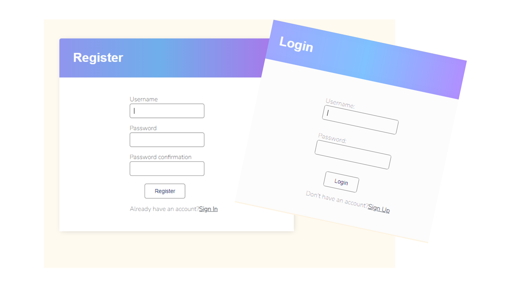

# TO_DO-list-With-user-authentication

This is a simple to-do app built with Django that allows users to create, manage, and search tasks. It includes authentication features for user registration and login.

<a href="http://prathmeshjagtap.pythonanywhere.com/login/?next=/" target="_blank">Try Now</a>

## Installation

1. Clone the repository:

   ```bash
   git clone <repo-name>
   ```

2. Navigate to the project directory:

   ```bash
   cd TODO_APP
   ```

3. Create a virtual environment:

   ```bash
   python -m venv venv
   ```

4. Activate the virtual environment:

   - For Windows:

     ```bash
     . venv\Scripts\activate
     ```

   - For macOS/Linux:

     ```bash
     source venv/bin/activate
     ```

5. Install the dependencies:

   ```bash
   pip install -r requirements.txt
   ```

6. Apply the database migrations:

   ```bash
   python manage.py migrate
   ```

7. Start the development server:

   ```bash
   python manage.py runserver
   ```

8. Open your browser and visit `http://localhost:8000` to access the app.

## Usage

1. Register a new account by clicking on the "Register" link on the homepage.

2. After registering, log in using your credentials.

3. Once logged in, you will be redirected to the dashboard where you can view, add, edit, and delete tasks.

4. To add a new task, click on the "Add Task" button and fill in the details.

5. To edit a task, click on the task title and make the necessary changes.

6. To delete a task, click on the trash/delete icon next to the task.

7. To search for tasks, use the search bar at the top of the dashboard. Enter keywords related to the tasks you want to find and press Enter.

## Features

- User authentication: Register and login to access the app.
- CRUD operations: Create, read, update, and delete tasks.
- Search functionality: Find tasks by searching for keywords.
- Class-based views: The views are implemented using Django's class-based views for better code organization and reusability.

## Contributing

Contributions are welcome! If you find any issues or want to add new features, please open an issue or submit a pull request.

## Acknowledgements

This app was developed using Django, a high-level Python web framework. Thanks to the Django community for their excellent documentation and resources.

## Contact

If you have any questions or suggestions, feel free to reach out to the project maintainers:

- [Author](https://github.com/prathmesh-jagtap)

We hope you find this to-do app useful and enjoy using it for your task management needs!

Keep Learning !!!
<hr>
<h1 align="center">Thanks For Watching. 👏</h1>
